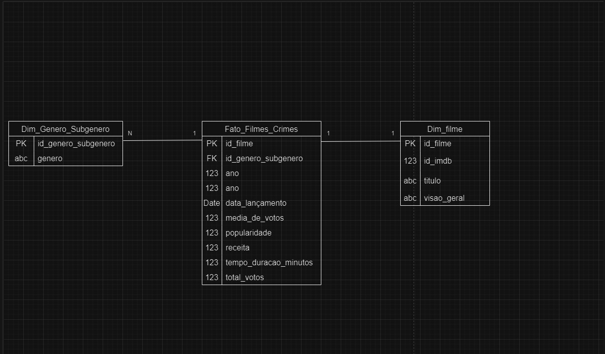

# Tarefa 3: Desafio Parte 3 - Processamento da Trusted

## Execução do código 

## S3 com o parquet 

# Tarefa 4: Modelagem multidimensional

# Tarefa 5: Camada Refined

## Execução do código 

## Arquivos parquet no s3

